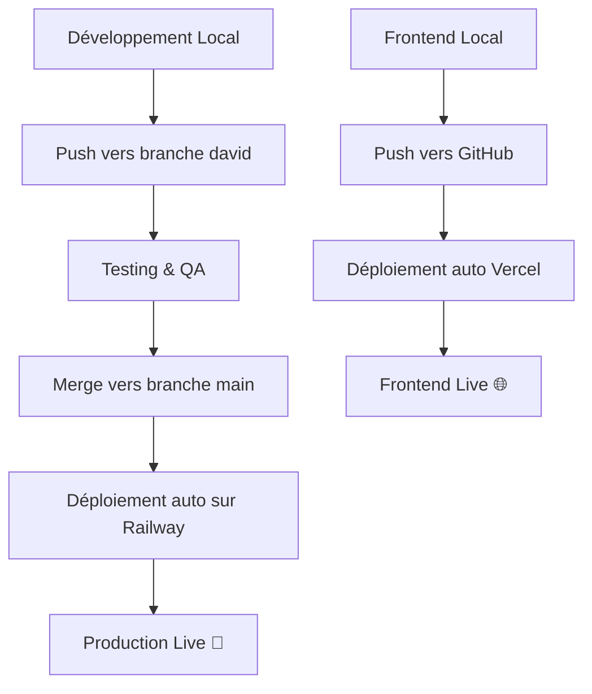

# 🌍 **GUIDE COMPLET: METTRE STOCKCHEF EN PRODUCTION**

## 🚀 **ÉTAPES POUR DEPLOY SUR RAILWAY.APP (GRATUIT)**

### **1. S'INSCRIRE SUR RAILWAY**
```bash
# 1. Allez sur: https://railway.app
# 2. Inscrivez-vous avec votre compte GitHub
# 3. Connectez votre dépôt stockchef-back
# 4. Obtenez $5 USD gratuit + 500 heures/mois
```

### **2. CONFIGURER LA BASE DE DONNÉES**
```sql
-- Railway vous donnera automatiquement:
✅ PostgreSQL gratuite
✅ Variables d'environnement automatiques
✅ URL de connexion: DATABASE_URL
✅ Sauvegardes automatiques
```

### **3. VARIABLES D'ENVIRONNEMENT SUR RAILWAY**
```bash
# Dans Railway Dashboard > Variables:
SPRING_PROFILES_ACTIVE=production
DATABASE_URL=(automatique)
JWT_SECRET=votre-clé-super-secrète-minimum-32-caractères
FRONTEND_URL=https://votre-frontend.vercel.app
PORT=8090
```

### **4. CONFIGURATION AUTOMATIQUE**
```yaml
# Railway détecte automatiquement:
✅ Projet Java 21+
✅ Outil de build Maven  
✅ Port depuis variable PORT
✅ Health checks automatiques
```

## 🌐 **ÉTAPES DE DÉPLOIEMENT**

### **OPTION A: DEPUIS LE TABLEAU DE BORD RAILWAY**
1. **Connecter le Dépôt**
   ```
   ✅ Login Railway → New Project
   ✅ Connect GitHub → Select stockchef-back  
   ✅ Auto-deploy branch: main
   ```

2. **Configurer les Variables**
   ```
   ✅ Paramètres → Variables → Ajouter :
     - SPRING_PROFILES_ACTIVE=production
     - JWT_SECRET=(générer clé sécurisée 32+ caractères)
     - FRONTEND_URL=https://votre-domaine.com
   ```

3. **Ajouter Base de Données**
   ```
   ✅ Ajouter Service → PostgreSQL
   ✅ Se connecte automatiquement via DATABASE_URL
   ```

### **OPTION B : CLI RAILWAY**
```bash
# Installer Railway CLI
npm install -g @railway/cli

# Connexion et déploiement
railway login
railway link (sélectionner le projet)
railway up

# Voir les logs en temps réel  
railway logs
```

## 🔗 **RÉSULTAT FINAL**
```
🌍 Backend URL: https://stockchef-back-production.up.railway.app/api
🔍 Health Check: https://stockchef-back-production.up.railway.app/api/health
🔐 Login Endpoint: https://stockchef-back-production.up.railway.app/api/auth/login

# Test depuis n'importe où dans le monde :
curl -X POST https://stockchef-back-production.up.railway.app/api/auth/login \
  -H "Content-Type: application/json" \
  -d '{"email":"developer@stockchef.com","password":"devpass123"}'
```

## 📱 **FRONTEND AVEC IONIC + REACT**

### **CONFIGURATION IONIC REACT**
```bash
# Installer Ionic CLI
npm install -g @ionic/cli

# Créer le projet
ionic start stockchef-front react --type=react --capacitor

# Configurer pour consommer votre API
cd stockchef-front
npm install axios
```

### **CONFIGURATION POUR PRODUCTION**
```typescript
// src/config/api.ts
const API_BASE_URL = process.env.NODE_ENV === 'production' 
  ? 'https://stockchef-back-production.up.railway.app/api'
  : 'http://localhost:8090/api';

export default API_BASE_URL;
```

### **DÉPLOIEMENT FRONTEND SUR VERCEL (GRATUIT)**
```bash
# 1. Push vers GitHub
git push origin main

# 2. Connecter sur vercel.com
# 3. Déploiement automatique depuis GitHub
# 4. URL : https://stockchef-front.vercel.app
```

## 📊 **FLUX DE DÉVELOPPEMENT PROFESSIONNEL**



## 🔄 **COMMANDES POUR GÉRER LES BRANCHES**

```bash
# Développement (branche david)
git checkout david
git pull origin david
# ... faire des modifications ...
git add .
git commit -m "Nouvelle fonctionnalité"
git push origin david

# Production (branche main)  
git checkout main
git merge david          # Fusionner le développement
git push origin main     # Déploiement auto sur Railway
```

## 🎯 **AVANTAGES DE CETTE CONFIGURATION**

```
✅ GRATUIT : 0€/mois pour commencer
✅ GLOBAL : Accessible depuis n'importe quel pays  
✅ SCALABLE : Mise à niveau facile quand nécessaire
✅ PROFESSIONNEL : CI/CD automatique
✅ SÉCURISÉ : HTTPS automatique + PostgreSQL
✅ MONITORING : Logs et métriques inclus
```

## 🛡️ **SÉCURITÉ EN PRODUCTION**

```bash
# Variables à NE JAMAIS pousser sur GitHub :
JWT_SECRET=clé-super-secrète-production
DATABASE_PASSWORD=mot-de-passe-sécurisé

# Toujours utiliser les variables d'environnement dans Railway
# ✅ Sécurité → Variables d'Environnement
```

## 📈 **PROCHAINES ÉTAPES**

1. **Déployer Backend** → Railway (15 min)
2. **Créer Frontend** → Ionic React (2 heures)  
3. **Déployer Frontend** → Vercel (10 min)
4. **Configurer CORS** → Backend pour autoriser le frontend
5. **Tests E2E** → Tester depuis la France 🇫🇷

**Voulez-vous que je vous aide avec une étape spécifique ?** 🚀