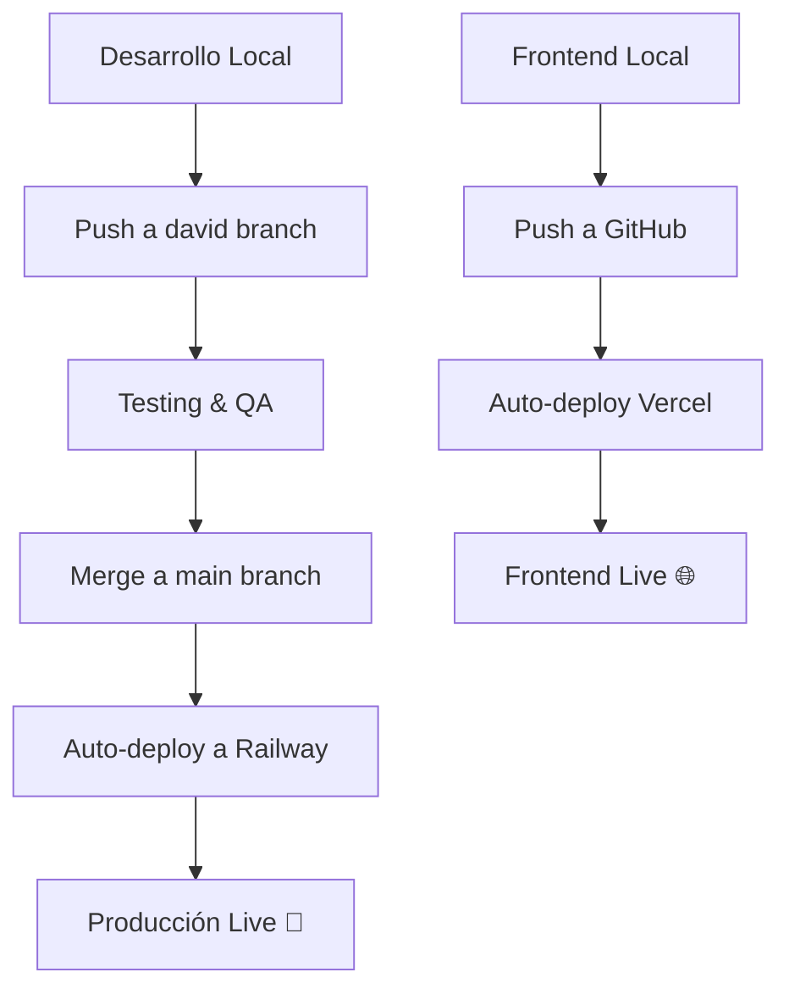

# 🌍 **GUIDE COMPLET: METTRE STOCKCHEF EN PRODUCTION**

## 🚀 **ÉTAPES POUR DEPLOY SUR RAILWAY.APP (GRATUIT)**

### **1. S'INSCRIRE SUR RAILWAY**
```bash
# 1. Allez sur: https://railway.app
# 2. Inscrivez-vous avec votre compte GitHub
# 3. Connectez votre dépôt stockchef-back
# 4. Obtenez $5 USD gratuit + 500 heures/mois
```

### **2. CONFIGURER LA BASE DE DONNÉES**
```sql
-- Railway vous donnera automatiquement:
✅ PostgreSQL gratuite
✅ Variables d'environnement automatiques
✅ URL de connexion: DATABASE_URL
✅ Sauvegardes automatiques
```

### **3. VARIABLES D'ENVIRONNEMENT SUR RAILWAY**
```bash
# Dans Railway Dashboard > Variables:
SPRING_PROFILES_ACTIVE=production
DATABASE_URL=(automatique)
JWT_SECRET=votre-clé-super-secrète-minimum-32-caractères
FRONTEND_URL=https://votre-frontend.vercel.app
PORT=8090
```

### **4. CONFIGURATION AUTOMATIQUE**
```yaml
# Railway détecte automatiquement:
✅ Projet Java 21+
✅ Outil de build Maven  
✅ Port depuis variable PORT
✅ Health checks automatiques
```

## 🌐 **ÉTAPES DE DÉPLOIEMENT**

### **OPTION A: DEPUIS LE TABLEAU DE BORD RAILWAY**
1. **Connecter le Dépôt**
   ```
   ✅ Login Railway → New Project
   ✅ Connect GitHub → Select stockchef-back  
   ✅ Auto-deploy branch: main
   ```

2. **Configurar Variables**
   ```
   ✅ Settings → Variables → Add:
     - SPRING_PROFILES_ACTIVE=production
     - JWT_SECRET=(generar clave segura 32+ chars)
     - FRONTEND_URL=https://tu-dominio.com
   ```

3. **Agregar Base de Datos**
   ```
   ✅ Add Service → PostgreSQL
   ✅ Se conecta automáticamente via DATABASE_URL
   ```

### **OPCIÓN B: RAILWAY CLI**
```bash
# Instalar Railway CLI
npm install -g @railway/cli

# Login y deploy
railway login
railway link (seleccionar proyecto)
railway up

# Ver logs en tiempo real  
railway logs
```

## 🔗 **RESULTADO FINAL**
```
🌍 Backend URL: https://stockchef-back-production.up.railway.app/api
🔍 Health Check: https://stockchef-back-production.up.railway.app/api/health
🔐 Login Endpoint: https://stockchef-back-production.up.railway.app/api/auth/login

# Test desde cualquier parte del mundo:
curl -X POST https://stockchef-back-production.up.railway.app/api/auth/login \
  -H "Content-Type: application/json" \
  -d '{"email":"developer@stockchef.com","password":"devpass123"}'
```

## 📱 **FRONTEND CON IONIC + REACT**

### **SETUP IONIC REACT**
```bash
# Instalar Ionic CLI
npm install -g @ionic/cli

# Crear proyecto
ionic start stockchef-front react --type=react --capacitor

# Configurar para consumir tu API
cd stockchef-front
npm install axios
```

### **CONFIGURACIÓN PARA PRODUCCIÓN**
```typescript
// src/config/api.ts
const API_BASE_URL = process.env.NODE_ENV === 'production' 
  ? 'https://stockchef-back-production.up.railway.app/api'
  : 'http://localhost:8090/api';

export default API_BASE_URL;
```

### **DEPLOY FRONTEND EN VERCEL (GRATIS)**
```bash
# 1. Push a GitHub
git push origin main

# 2. Conectar en vercel.com
# 3. Auto-deploy desde GitHub
# 4. URL: https://stockchef-front.vercel.app
```

## 📊 **FLUJO DE DESARROLLO PROFESIONAL**



## 🔄 **COMANDOS PARA GESTIONAR RAMAS**

```bash
# Desarrollo (rama david)
git checkout david
git pull origin david
# ... hacer cambios ...
git add .
git commit -m "Nueva funcionalidad"
git push origin david

# Producción (rama main)  
git checkout main
git merge david          # Fusionar desarrollo
git push origin main     # Auto-deploy a Railway
```

## 🎯 **VENTAJAS DE ESTE SETUP**

```
✅ GRATUITO: $0/mes para empezar
✅ GLOBAL: Accessible desde cualquier país  
✅ ESCALABLE: Fácil upgrade cuando necesites
✅ PROFESIONAL: CI/CD automático
✅ SEGURO: HTTPS automático + PostgreSQL
✅ MONITOREO: Logs y métricas incluidas
```

## 🛡️ **SEGURIDAD EN PRODUCCIÓN**

```bash
# Variables que NUNCA subir a GitHub:
JWT_SECRET=clave-super-secreta-produccion
DATABASE_PASSWORD=password-seguro

# Usar siempre variables de entorno en Railway
# ✅ Security → Environment Variables
```

## 📈 **PRÓXIMOS PASOS**

1. **Deploy Backend** → Railway (15 min)
2. **Crear Frontend** → Ionic React (2 horas)  
3. **Deploy Frontend** → Vercel (10 min)
4. **Configurar CORS** → Backend para permitir frontend
5. **Testing E2E** → Probar desde Francia 🇫🇷

**¿Quieres que te ayude con algún paso específico?** 🚀