# 🌍 **GUÍA COMPLETA: PONER STOCKCHEF EN PRODUCCIÓN**

## 🚀 **PASOS PARA DEPLOY EN RAILWAY.APP (GRATUITO)**

### **1. REGISTRARSE EN RAILWAY**
```bash
# 1. Ve a: https://railway.app
# 2. Registrate con tu cuenta de GitHub
# 3. Conecta tu repositorio stockchef-back
# 4. Obtén $5 USD gratis + 500 horas/mes
```

### **2. CONFIGURAR BASE DE DATOS**
```sql
-- Railway te dará automáticamente:
✅ PostgreSQL gratuita
✅ Variables de entorno automáticas
✅ URL de conexión: DATABASE_URL
✅ Backups automáticos
```

### **3. VARIABLES DE ENTORNO EN RAILWAY**
```bash
# En Railway Dashboard > Variables:
SPRING_PROFILES_ACTIVE=production
DATABASE_URL=(automático)
JWT_SECRET=tu-clave-super-secreta-minimo-32-caracteres
FRONTEND_URL=https://tu-frontend.vercel.app
PORT=8090
```

### **4. CONFIGURACIÓN AUTOMÁTICA**
```yaml
# Railway detecta automáticamente:
✅ Java 21+ project
✅ Maven build tool  
✅ Puerto desde variable PORT
✅ Health checks automáticos
```

## 🌐 **DEPLOYMENT STEPS**

### **OPCIÓN A: DESDE RAILWAY DASHBOARD**
1. **Conectar Repositorio**
   ```
   ✅ Login Railway → New Project
   ✅ Connect GitHub → Select stockchef-back  
   ✅ Auto-deploy branch: main
   ```

2. **Configurar Variables**
   ```
   ✅ Settings → Variables → Add:
     - SPRING_PROFILES_ACTIVE=production
     - JWT_SECRET=(generar clave segura 32+ chars)
     - FRONTEND_URL=https://tu-dominio.com
   ```

3. **Agregar Base de Datos**
   ```
   ✅ Add Service → PostgreSQL
   ✅ Se conecta automáticamente via DATABASE_URL
   ```

### **OPCIÓN B: RAILWAY CLI**
```bash
# Instalar Railway CLI
npm install -g @railway/cli

# Login y deploy
railway login
railway link (seleccionar proyecto)
railway up

# Ver logs en tiempo real  
railway logs
```

## 🔗 **RESULTADO FINAL**
```
🌍 Backend URL: https://stockchef-back-production.up.railway.app/api
🔍 Health Check: https://stockchef-back-production.up.railway.app/api/health
🔐 Login Endpoint: https://stockchef-back-production.up.railway.app/api/auth/login

# Test desde cualquier parte del mundo:
curl -X POST https://stockchef-back-production.up.railway.app/api/auth/login \
  -H "Content-Type: application/json" \
  -d '{"email":"developer@stockchef.com","password":"devpass123"}'
```

## 📱 **FRONTEND CON IONIC + REACT**

### **SETUP IONIC REACT**
```bash
# Instalar Ionic CLI
npm install -g @ionic/cli

# Crear proyecto
ionic start stockchef-front react --type=react --capacitor

# Configurar para consumir tu API
cd stockchef-front
npm install axios
```

### **CONFIGURACIÓN PARA PRODUCCIÓN**
```typescript
// src/config/api.ts
const API_BASE_URL = process.env.NODE_ENV === 'production' 
  ? 'https://stockchef-back-production.up.railway.app/api'
  : 'http://localhost:8090/api';

export default API_BASE_URL;
```

### **DEPLOY FRONTEND EN VERCEL (GRATIS)**
```bash
# 1. Push a GitHub
git push origin main

# 2. Conectar en vercel.com
# 3. Auto-deploy desde GitHub
# 4. URL: https://stockchef-front.vercel.app
```

## 📊 **FLUJO DE DESARROLLO PROFESIONAL**

```mermaid
graph TD
    A[Desarrollo Local] --> B[Push a david branch]
    B --> C[Testing & QA]
    C --> D[Merge a main branch] 
    D --> E[Auto-deploy a Railway]
    E --> F[Producción Live 🚀]
    
    G[Frontend Local] --> H[Push a GitHub]
    H --> I[Auto-deploy Vercel]
    I --> J[Frontend Live 🌐]
```



## 🔄 **COMANDOS PARA GESTIONAR RAMAS**

```bash
# Desarrollo (rama david)
git checkout david
git pull origin david
# ... hacer cambios ...
git add .
git commit -m "Nueva funcionalidad"
git push origin david

# Producción (rama main)  
git checkout main
git merge david          # Fusionar desarrollo
git push origin main     # Auto-deploy a Railway
```

## 🎯 **VENTAJAS DE ESTE SETUP**

```
✅ GRATUITO: $0/mes para empezar
✅ GLOBAL: Accessible desde cualquier país  
✅ ESCALABLE: Fácil upgrade cuando necesites
✅ PROFESIONAL: CI/CD automático
✅ SEGURO: HTTPS automático + PostgreSQL
✅ MONITOREO: Logs y métricas incluidas
```

## 🛡️ **SEGURIDAD EN PRODUCCIÓN**

```bash
# Variables que NUNCA subir a GitHub:
JWT_SECRET=clave-super-secreta-produccion
DATABASE_PASSWORD=password-seguro

# Usar siempre variables de entorno en Railway
# ✅ Security → Environment Variables
```

## 📈 **PRÓXIMOS PASOS**

1. **Deploy Backend** → Railway (15 min)
2. **Crear Frontend** → Ionic React (2 horas)  
3. **Deploy Frontend** → Vercel (10 min)
4. **Configurar CORS** → Backend para permitir frontend
5. **Testing E2E** → Probar desde Francia 🇫🇷

**¿Quieres que te ayude con algún paso específico?** 🚀