# 🚀 Documentation de Déploiement en Production - Railway

## 📋 Table des Matières
1. [Vue d'ensemble du projet](#vue-densemble-du-projet)
2. [Qu'est-ce que Railway ?](#quest-ce-que-railway)
3. [Configuration et déploiement](#configuration-et-déploiement)
4. [Tests en production](#tests-en-production)
5. [Gestion des branches](#gestion-des-branches)
6. [Fonctionnalités avancées](#fonctionnalités-avancées)
7. [Surveillance et maintenance](#surveillance-et-maintenance)

---

## 🎯 Vue d'ensemble du projet

**StockChef Backend** est maintenant déployé avec succès sur Railway en production ! 

### ✅ Statut actuel
- ✅ **Application déployée** : `https://stockchef-back-production.up.railway.app`
- ✅ **Authentification JWT** fonctionnelle
- ✅ **Base de données H2** configurée
- ✅ **Endpoints API** opérationnels
- ✅ **Health checks** activés

---

## 🌐 Qu'est-ce que Railway ?

**Railway** est une plateforme cloud moderne qui simplifie le déploiement d'applications.

### 🔧 Avantages de Railway
- **Déploiement automatique** depuis GitHub
- **Gestion simplifiée** des bases de données
- **Scaling automatique** selon la demande
- **Logs en temps réel** pour le debugging
- **Variables d'environnement** sécurisées
- **Prix abordable** : Plan Hobby à 5$/mois

### 💰 Plans tarifaires
- **Plan Developer** : Gratuit (500h/mois)
- **Plan Hobby** : 5$/mois (recommandé pour production)
- **Plan Pro** : 20$/mois (pour équipes)

---

## ⚙️ Configuration et Déploiement

### 1. 🔗 Configuration GitHub - Railway

```yaml
# Connexion automatique configurée
Repository: DavidBonvin/stockchef-back
Branche: main (production automatique)
Auto-deploy: Activé sur main
```

### 2. 🐳 Configuration Docker

Fichier `Dockerfile` optimisé pour Railway :

```dockerfile
FROM openjdk:21-jdk-slim
VOLUME /tmp
COPY target/stockchef-back-0.0.1-SNAPSHOT.jar app.jar

# Health check pour Railway
HEALTHCHECK --interval=30s --timeout=3s --start-period=60s --retries=3 \
  CMD curl -f http://localhost:8090/api/health || exit 1

ENTRYPOINT ["java", "-jar", "/app.jar"]
```

### 3. 🌍 Variables d'environnement

Configuration appliquée sur Railway :

```bash
# Configuration automatique
PORT=8090                    # Port assigné par Railway
SPRING_PROFILES_ACTIVE=production

# JWT (à configurer si personnalisé)
JWT_SECRET=your_secret_key

# Base de données (Railway peut auto-configurer)
DATABASE_URL=jdbc:h2:mem:stockchef
```

### 4. 📁 Fichiers de configuration Railway

#### `.railwayignore`
```
node_modules/
.git/
*.log
target/classes/
src/test/
```

#### `railway.json` (optionnel)
```json
{
  "build": {
    "builder": "DOCKERFILE"
  },
  "deploy": {
    "restartPolicyType": "ON_FAILURE",
    "restartPolicyMaxRetries": 10
  }
}
```

---

## 🧪 Tests en Production

### 🔐 Authentification

**Endpoint** : `POST https://stockchef-back-production.up.railway.app/api/auth/login`

#### Utilisateurs de test disponibles :

| Rôle | Email | Mot de passe | Permissions |
|------|-------|--------------|-------------|
| **Développeur** | `developer@stockchef.com` | `devpass123` | Accès complet |
| **Administrateur** | `admin@stockchef.com` | `adminpass123` | Administration |
| **Chef** | `chef@stockchef.com` | `chefpass123` | Gestion cuisine |
| **Employé** | `employee@stockchef.com` | `emppass123` | Utilisateur standard |

#### Exemple de requête (Thunder Client/Postman) :

```http
POST https://stockchef-back-production.up.railway.app/api/auth/login
Content-Type: application/json

{
  "email": "developer@stockchef.com",
  "password": "devpass123"
}
```

#### Réponse attendue :
```json
{
  "token": "eyJhbGciOiJIUzI1NiJ9...",
  "email": "developer@stockchef.com",
  "fullName": "Developer Admin",
  "role": "ROLE_DEVELOPER",
  "expiresIn": 86400000
}
```

### 🩺 Health Checks

#### Endpoints de vérification :

```bash
# Status général
GET https://stockchef-back-production.up.railway.app/

# Health check détaillé
GET https://stockchef-back-production.up.railway.app/api/health

# Actuator (Spring Boot)
GET https://stockchef-back-production.up.railway.app/api/actuator/health
```

### 📊 Endpoints API disponibles

```bash
# Authentification
POST /api/auth/login          # Connexion utilisateur
GET  /api/auth/profile        # Profil (authentifié)

# Santé de l'application
GET  /api/health             # Status de l'application
GET  /api/health/info        # Informations détaillées
GET  /api/health/ping        # Test de connectivité

# Actuator (monitoring)
GET  /api/actuator           # Liste des endpoints
GET  /api/actuator/health    # Health check Spring Boot
```

---

## 🌿 Gestion des Branches

> ⚠️ **ATTENTION IMPORTANTE** ⚠️
> 
> **La branche `main` est directement connectée à la PRODUCTION !**
> 
> Tout commit sur `main` déclenchera un déploiement automatique en production.

### 🏗️ Workflow de développement recommandé

#### 1. **Branche Main (Production)**
```bash
# ❌ NE PAS développer directement sur main
# ✅ Uniquement pour les merges validés

git checkout main
git pull origin main
# Uniquement pour merger du code testé !
```

#### 2. **Branches de développement**
```bash
# Créer une nouvelle branche pour chaque fonctionnalité
git checkout -b feature/nouvelle-fonctionnalite
git checkout -b fix/correction-bug
git checkout -b hotfix/probleme-urgent

# Développer et tester localement
git add .
git commit -m "feat: ajout nouvelle fonctionnalité"
git push origin feature/nouvelle-fonctionnalite
```

#### 3. **Branches par environnement**
```bash
# Branche de développement
git checkout -b develop

# Branche de test/staging
git checkout -b staging

# Branche de production (main)
# main -> production automatique Railway
```

### 🔄 Processus de déploiement sécurisé

```mermaid
graph LR
    A[Développement local] --> B[Branche feature]
    B --> C[Tests locaux]
    C --> D[Pull Request]
    D --> E[Review de code]
    E --> F[Merge vers develop]
    F --> G[Tests staging]
    G --> H[Merge vers main]
    H --> I[🚀 Déploiement automatique]
    I --> J[Production Railway]
```



### 📋 Checklist avant merge en production

- [ ] ✅ Tests locaux passants
- [ ] ✅ Build Maven successful
- [ ] ✅ Tests d'intégration validés
- [ ] ✅ Review de code approuvée
- [ ] ✅ Documentation mise à jour
- [ ] ✅ Variables d'environnement vérifiées
- [ ] ✅ Backup de données si nécessaire

---

## 🚀 Fonctionnalités Avancées Railway

### 📊 **Monitoring et Logs**

#### Accès aux logs
```bash
# Dans l'interface Railway
1. Aller à votre projet -> stockchef-back
2. Onglet "Deployments"
3. Cliquer sur un déploiement
4. Voir les onglets : Build Logs, Deploy Logs, HTTP Logs
```

#### Types de logs disponibles
- **Build Logs** : Compilation et construction
- **Deploy Logs** : Démarrage de l'application
- **HTTP Logs** : Requêtes HTTP en temps réel
- **Application Logs** : Logs de votre application Spring Boot

### 🔧 **Variables d'environnement**

#### Configuration sécurisée
```bash
# Dans Railway Dashboard
Settings -> Variables

# Variables courantes pour Spring Boot
SPRING_PROFILES_ACTIVE=production
DATABASE_URL=postgresql://...
JWT_SECRET=your-super-secret-key
SMTP_HOST=smtp.gmail.com
SMTP_PORT=587
```

### 🌍 **Domaines personnalisés**

```bash
# Configuration d'un domaine personnalisé
1. Railway Dashboard -> Networking
2. Custom Domain -> Add Domain
3. Configurer DNS : CNAME vers railway.app
4. Certificat SSL automatique
```

### 📈 **Scaling et Performance**

```bash
# Configuration des ressources
Settings -> Resources
- CPU: 2 vCPU (max plan Hobby)
- Memory: 1 GB (max plan Hobby)
- Replicas: 1 (multi-région en Pro)
```

### 🔄 **Base de données**

```bash
# Ajouter une base de données
1. Railway Dashboard -> Add Service
2. Choisir : PostgreSQL, MySQL, MongoDB, Redis
3. Variables automatiquement injectées
4. Connection strings générés automatiquement
```

#### Exemple migration vers PostgreSQL
```properties
# application-production.properties
spring.datasource.url=${DATABASE_URL}
spring.datasource.driver-class-name=org.postgresql.Driver
spring.jpa.database-platform=org.hibernate.dialect.PostgreSQLDialect
```

### 🛡️ **Sécurité**

#### Features de sécurité Railway
- **Variables chiffrées** : Secrets sécurisés
- **HTTPS automatique** : SSL/TLS par défaut
- **Isolation réseau** : Private networking disponible
- **Backups automatiques** : Pour bases de données managées

---

## 📊 Surveillance et Maintenance

### 🔍 **Health Monitoring**

#### Configuration des health checks
```properties
# application-production.properties
management.endpoints.web.exposure.include=health,info,metrics
management.endpoint.health.show-details=always
management.health.db.enabled=true
```

#### Endpoints de monitoring
```bash
# Vérifications automatisées
GET /api/actuator/health      # Status général
GET /api/actuator/metrics     # Métriques application
GET /api/actuator/info        # Information version
```

### 📱 **Notifications**

#### Intégrations disponibles
- **Slack** : Notifications de déploiement
- **Discord** : Updates de status
- **Email** : Alertes critiques
- **Webhooks** : Intégrations personnalisées

### 💾 **Backups**

#### Stratégie de sauvegarde
```bash
# Base de données
1. Snapshots automatiques (PostgreSQL Railway)
2. Export manuel via Railway CLI
3. Scripts de backup personnalisés

# Code source
1. Repository GitHub (source of truth)
2. Branches tagués pour releases
3. Documentation versionnée
```

### 🔄 **CI/CD Avancé**

#### GitHub Actions intégration
```yaml
# .github/workflows/railway-deploy.yml
name: Railway Deploy
on:
  push:
    branches: [ main ]
jobs:
  deploy:
    runs-on: ubuntu-latest
    steps:
      - uses: actions/checkout@v2
      - name: Use Railway
        uses: railway/cli@v2
        with:
          command: up
        env:
          RAILWAY_TOKEN: ${{ secrets.RAILWAY_TOKEN }}
```

---

## 🎯 Prochaines Étapes

### 🚀 **Améliorations suggérées**

1. **Migration vers PostgreSQL**
   - Plus robuste pour la production
   - Fonctionnalités avancées
   - Backups automatiques

2. **Monitoring avancé**
   - Métriques personnalisées
   - Alertes automatiques
   - Dashboard de performance

3. **Sécurité renforcée**
   - Rate limiting
   - Validation d'entrée avancée
   - Logs d'audit

4. **Performance**
   - Cache Redis
   - Optimisation requêtes
   - CDN pour assets statiques

### 📚 **Ressources utiles**

- **Railway Documentation** : https://docs.railway.app
- **Spring Boot Railway** : https://docs.railway.app/guides/spring-boot
- **Railway CLI** : https://docs.railway.app/develop/cli

---

## ⚡ Commandes Rapides

```bash
# Vérification rapide production
curl https://stockchef-back-production.up.railway.app/api/health

# Test d'authentification
curl -X POST https://stockchef-back-production.up.railway.app/api/auth/login \
  -H "Content-Type: application/json" \
  -d '{"email":"developer@stockchef.com","password":"devpass123"}'

# Status détaillé
curl https://stockchef-back-production.up.railway.app/api/actuator/health
```

---

## 👥 Support et Contact

- **Documentation projet** : README.md principal
- **Issues GitHub** : Pour bugs et suggestions
- **Railway Support** : Pour problèmes de plateforme

---

> 🎉 **Félicitations !** Votre backend StockChef est maintenant en production sur Railway avec un déploiement automatique sécurisé.
> 
> N'oubliez pas : **main = production** ! Utilisez des branches pour le développement.
